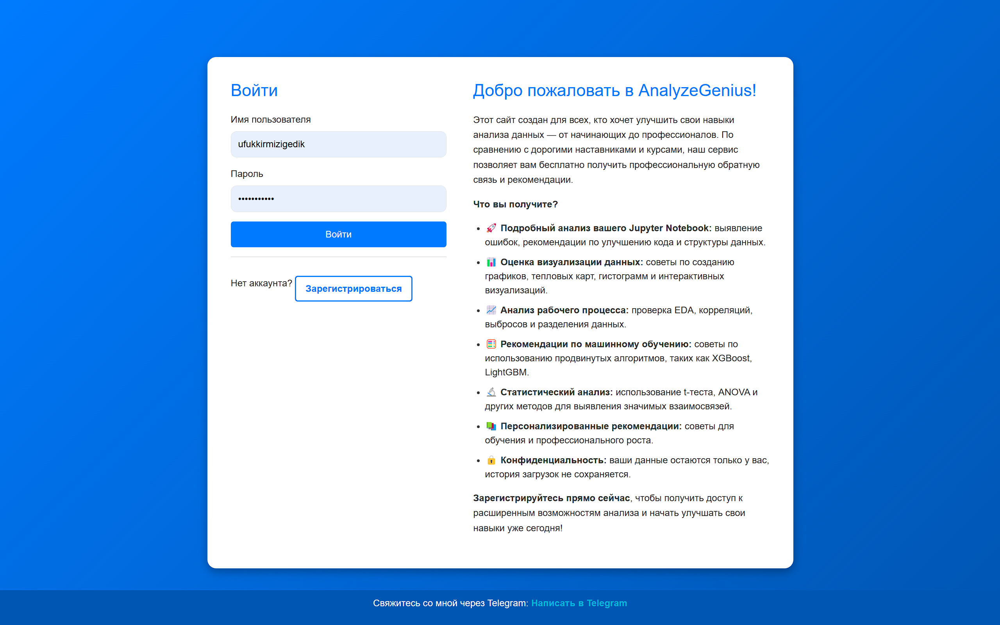
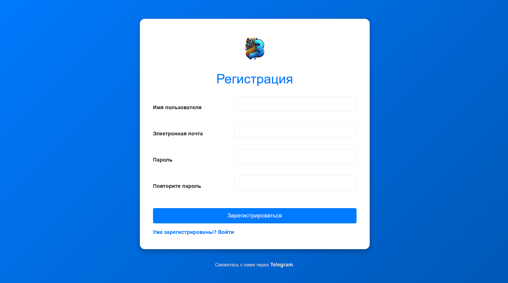

# Анализатор Jupyter Notebook

Этот проект представляет собой веб-приложение для анализа Jupyter Notebook файлов. Пользователи могут загружать свои файлы, получать детальный анализ своих данных и получать рекомендации по улучшению аналитических навыков.

## Особенности
- Регистрация и подтверждение электронной почты для новых пользователей.
- Авторизация для доступа к защищённым страницам.
- Возможность загрузки Jupyter Notebook файлов.
- Подробный анализ содержимого файла с использованием OpenAI API.
- Пошаговые рекомендации для улучшения данных и навыков анализа.
- Лимитированное количество анализов для пользователей с возможностью пополнения.
- Современный и адаптивный интерфейс.

## Технологии
- **Язык программирования:** Python
- **Фреймворк:** Django
- **База данных:** SQLite (по умолчанию, можно заменить на другую)
- **API:** OpenAI GPT-4
- **Фронтенд:** HTML, CSS, Bootstrap

## Установка и настройка

### Требования
- Python 3.11


### Инструкции по установке
1. Клонируйте репозиторий:
   ```bash
   git clone https://github.com/yourusername/SkillAnalyzer.git
   cd SkillAnalyzer
   ```
2. Создайте виртуальное окружение и активируйте его:
   ```bash
   python -m venv venv
   source venv/bin/activate  # Для Windows используйте: venv\Scripts\activate
   ```
3. Установите зависимости:
   ```bash
   pip install -r requirements.txt
   ```
4. Примените миграции базы данных:
   ```bash
   python manage.py migrate
   ```
5. Создайте суперпользователя для доступа к панели администратора:
   ```bash
   python manage.py createsuperuser
   ```
6. Запустите локальный сервер:
   ```bash
   python manage.py runserver
   ```

Приложение будет доступно по адресу: `http://127.0.0.1:8000/`

## Переменные окружения
Для работы проекта требуется добавить следующие переменные окружения в файл `.env`:

```
SECRET_KEY=ваш_секретный_ключ
OPENAI_API_KEY=ваш_ключ_OpenAI
EMAIL_HOST=smtp.gmail.com
EMAIL_PORT=587
EMAIL_HOST_USER=ваш_email@gmail.com
EMAIL_HOST_PASSWORD=пароль_или_ключ_приложения
EMAIL_USE_TLS=True
```

## Основные страницы
- **Регистрация:** `/accounts/register/`
- **Вход:** `/accounts/login/`
- **Панель управления:** `/accounts/dashboard/`
- **Загрузка файлов:** `/accounts/upload/`

## Лицензия
Этот проект распространяется под лицензией MIT. Для получения подробной информации ознакомьтесь с файлом `LICENSE`.

## Контакты
Если у вас есть вопросы или предложения, пожалуйста, свяжитесь с нами:
- Telegram: https://t.me/K_Ufuk
- Email: ufukkirmizigedik1984@gmail.com

## Скриншоты
### Login Page


### Register Page

